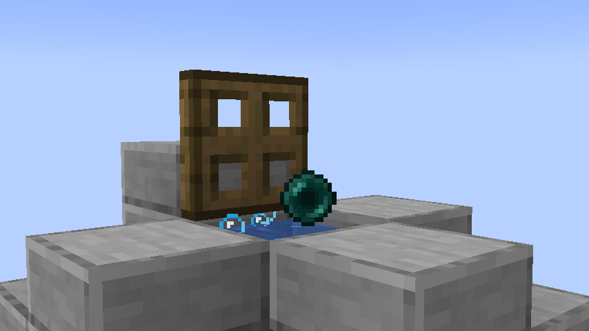

# Persistent Pearls

This is a simple one-mixin mod to disable unnecessary Ender Pearl despawn behaviour. 

If you weren't aware, thrown Ender Pearls
normally delete themselves the moment the player who threw them dies, provided the pearl is in a loaded chunk.
This can be problematic when trying to make use of Ender Pearl stasis chambers, which hold a thrown pearl in one spot 
indefinitely to allow instant teleportation across your world.

This mod adds a gamerule called `persistentPearls`, enabled by default,
which will ensure thrown Ender Pearls never despawn.

